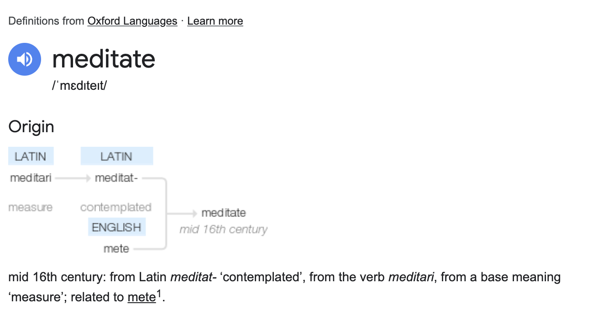

I have always been curious about what meditation was and spent decades trying to understand it in essence. It was only recently that I was able to get some understanding and clarity about the popular yet not-so-well-understood activity, that seems esoteric. 

My only objective to pen down my learnings here is to help those who might be in similar shoes, so that they won't waste as much time as I did. Once you get a grasp over it, it shall only help you get better in various aspects of life and reveal your true potential.

---

## Some Myth-busting

First of all, let’s quickly clear out the mis-aligned ideas / mis-attributions. These are based on the wisdom shared by the thousands of the wisemen, over a course of centuries and adapated by me for my own practice. 

You can be sure about meditation, that:

- · It isn’t anything magical
- · It isn’t other-worldly
- · It won’t degrade any of your senses or your intellect
- · It won’t make you mentally blunt
- · It isn’t instantly rewarding
- · It isn’t instantly peaceful
- · It is not anything entertaining
- · There is no single kind of meditation
- · It is not an activity that you can do randomly - Like going for a walk one day, meeting a prospective client for a quick meeting, etc.

## But why so?? What is it then?
Let’s first understand the word roots. 

As we can see the English word comes from a mutation of a latin word that means contemplation. This is what the word meditation initially meant, and lot of heavyweights in the western society used it quite effectively to make their lives better in various ways. But it had its limitations. This understanding puts too much pressure on the intellectual part of our existence, and that is only a limited part of us.

On the other hand, the eastern world - more specifically in the Indian subcontinent, the word that is used for the similar practice is called ‘Dhyan / Dhyana / ध्यान’. The same word is also used for other meanings in different contexts - to do something carefully, to apply your attention, to focus on something, etc. If you look at the activity from this perspective, you might find it more useful - as it won’t tell you which center to use to apply your attention to something/anything. 

What it means is to learn, over time, how to apply your complete existence itself to focus on something, in a hyper-most-attentive manner. That is the goal of practice. For some it might take years, for others it might take just a few months. It all depends upon how well you understand the task at hand, how well-intended and curious you are, and then a few other factors that are beyond our control.

## But why is it called a practice?
Because, it is something that we develop. It is a technique that we have to internalize over time - through sincere and sheer practice. Others can only give you pointers as to how to go about it, but only when we try it day-by-day, we can experience the essence of it and internalize it. 

It’s like learning how to ride a bike or drive a car, how to write, how to touch-type on a keyboard, how to speak a new language, etc.

Another analogy is fitness training. No book can get you fit, you have to goto the gym in a periodic and disciplined manner. But going to gym everyday without any knowledge is futile too, ignoring the random chances that you might end up doing something right - but there are even higher chances of hurting yourself. This is why, everyone tells you to practice it under the guidance of a knowledgeable Guru, who means well and don’t have any incentives attached to guide you. If they are asking for a fees, then it’s better to seek help elsewhere (unless you want to give them something out of your own volition, after you have benefited from the knowledge that they imparted selflessly).

> ‘Dhyan’ is a fitness training, but of the mind / cognitive muscles.

And it can only be done by doing it:
- · at the same time everyday
- · at the same place everyday
- · without taking breaks / cheat-days
- · with sincerity
- · with innate curiosity, to learn yourself at the deeper level
- · with a (borderline uncomfortable) long duration [a duration that practically fits well with your other responsibilities, but longer than you can handle - · generally ~1hr/session is a good starting point], 
- · preferably during dawn and dusk, and 
- · Without moving even a centimeter 
- · Preferably after taking a bath
- · Preferably without anything around you that is too sensory titillating 
- · Preferably with an empty stomach 
- · With courage
- · With will-power
- ...

## Important Context
There are multiple schools of dhyana, that had evolved from the ancient Vedic schools. If you understand the core-essence of them all, you’ll see that they are one and same, but told in different ways for different outcomes. Just like how there are different types of exercises prescribed for the strenghtning of different types of muscles / muscle groups.

The word Dhyan, when travelled to China (via Buddhism), mutated to Chan, and when it traveled further to Japan, it mutated / transformed further into Zen. Language and culture hence had a major impact on shaping up the various traditions of Dhyana, and should be read up more on - if this give you a better understanding of how it all came to be and looks what it looks like right now in the current times.

## Advait Vedant - a short introduction and background

Advaita Vedanta (/ʌdˈvaɪtə vɛˈdɑːntə/; Sanskrit: अद्वैत वेदान्त, IAST: Advaita Vedānta) is a path of spiritual discipline and experience.

The term Advaita, means Non-Dual. That there are no two entities  in all of our experiential universe. Within and without. It’s all one. You can call that non-dual nature of universe anything, but for consistency’s sake it was called Brahman. But you can even call it the One, or anything if that helps you. It is beyond the religious practices and humanity, it is beyond time and space, it is beyond anything and everything, yet encompassing anything and everything. It is all pervading and omnipotent.

It is. It was. It will be. 

It’s even you/me - the real you/me. 

But since our attention spans are muddled with smaller things, temporary things, meaning-eating things, we prevent ourselves from seeing it, as it requires higher levels of attention. 

> Just like a fish never knows the water around it, and only after seeing the world outside the surface - it can get a glimpse of what the water is.

> Another story is of mulla nasuriddin and the donkeys.

Hence, the practice of ‘Dhyana Sadhana’ (Long Term Attention Enhancement Practice Tradition) is given such a big importance in the whole of Vedanta.

To understand Sadhana, we can again look at its word root. Sadhana means ‘to Balance’ in Hindi/Sanskrit. The act of balancing the (everyday enhancing) attention span with your experiential material life. The one who does this is called the Sadhak or Sadhu (the Balancer). The thing that is getting balanced is called the Sadhya (the Balanced). 

Hence, the One is seated deep within us - all the time, since our birth and will be there till the death. We don’t have to go around the 4 corners of the world to find it. The shortest route is to go inwards, but with sincerity, and deep curiosity - and not outwards. Develop the Dhyan capacity everyday - into the Sadhana, and then you can realize the real you - without any external requirements or material entities. 

The real or the true self is denoted as Aatman / Aatma.
It is our ultimate essence. And you don’t have to believe in any god or goddess, if you don’t want to believe in any of that, to understand your true nature. Just believe in you - the real you, that is much bigger than what you have been identifying yourself with. 

What we identify with everyday is a very small subset of ourselves, that is the conception of nascent childhood - with simpler needs and requirements - of food, resources, security, survival, etc. and for the purpose of protecting ourselves from danger, bad outcomes, etc. It served it’s purpose to get us out of our fragile childhood. But now it’s a vestige of a past that is not serving you anymore, but actually doing more harm to you - by keeping you unsatisfied internally, crumbling your sense of meaning, keeping you astray from your purpose, etc. This identification, is popularly known as Ego too, in Hindi it’s called Ahem - being too obsessed or attached with the sense of self. It makes us self-centered, prevents us from questioning assumptions, doubts, bad-habits, etc. 

Taming the ego requires subtle thought work. And for that to happen, you gotta make yourself subtle. But that can only happen if we let go of intensities in our lives, of all kinds - visual, aural, olfactory, taste, touch, etc. Moreover, of cognitive types too - intense thoughts, emotions, experiences, etc. 

When we make our lives more (so-called) trivial and mundane, our senses become highly refined and super-charged. That’s when the our attentional capacity increases and our awareness develops even further, compounding our day-to-day balancing practice. 

#### The three levels of Reality or Truth

As per a description, by the wise ones, there are three levels of reality:
1. · Pāramārthika / Sat / Aatman (Of Ultimate Meaning / Absolute / Pure): It is the non-changing type.
2. · Vyāvahārika / Avidya / Maya (Social / Derivative): It is the temporary type. "our world of experience, the phenomenal world that we handle every day when we are awake”. here, the material world is also true but this is incomplete reality and is sublatable.
3. · Prātibhāsika (Apparent): “Reality based on imagination alone”. It is the level of experience in which the mind constructs its own reality. Well-known examples of Pratibhasika is the imaginary reality such as the "roaring of a lion" fabricated in dreams during one's sleep, and the perception of a rope in the dark as being a snake.

#### The three Koshas (Sheaths) 

Due to Avidya, Aatman is covered by koshas (sheaths or bodies), which hide man's true nature. According to the Taittiriya Upanishad, the Atman is covered by five koshas, usually rendered "sheath". They are often visualized like the layers of an onion.  From gross to fine the five sheaths are:

1. · Annamaya kosha, physical/food sheath
2. · Pranamaya kosha, life-force sheath
3. · Manomaya kosha, mental sheath
4. · Vijnanamaya kosha, discernment/wisdom sheath
5. · Anandamaya kosha, bliss sheath (Ananda)

### Attaining Vidya (The Knowledge of the Self)
Advaita Vedānta regards the liberated state of being Atman-Brahman as one's true identity and inherent to being human. According to Shankara and the Vivarana-school, no human action can 'produce' this liberated state, as it is what one already is. As Swami Vivekananda stated:

> The Vedas cannot show you Brahman, you are That already. They can only help to take away the veil that hides truth from our eyes. The cessation of ignorance can only come when I know that God and I are one; in other words, identify yourself with Atman, not with human limitations. The idea that we are bound is only an illusion [Maya]. Freedom is inseparable from the nature of the Atman. This is ever pure, ever perfect, ever unchangeable.
> - — Adi Shankara's commentary on Fourth Vyasa Sutra, Swami Vivekananda

Yet, the Advaita-tradition also emphasizes human effort, the path of Jnana Yoga, a progression of study and training to realize one's true identity as Atman-Brahman and attain moksha. According to critics of neo-Advaita, which also emphasizes direct insight, traditional Advaita Vedanta entails more than self-inquiry or bare insight into one's real nature, but also includes self-restraint, textual studies and ethical perfection. It is described in classical Advaita books like Shankara's Upadesasahasri and the Vivekachudamani, which is also attributed to Shankara.

Sruti (scriptures), proper reasoning and meditation are the main sources of knowledge (vidya) for the Advaita Vedānta tradition. It teaches that correct knowledge of Atman and Brahman is achievable by svādhyāya, study of the self and of the Vedic texts, and three stages of practice: sravana (perception, hearing), manana (thinking) and nididhyasana (meditation), a three-step methodology that is rooted in the teachings of chapter 4 of the Brihadaranyaka Upanishad.

#### Preparation: the fourfold qualities
The Advaita student has to develop the fourfold qualities, or behavioral qualifications (Samanyasa, Sampattis, sādhana-catustaya): A student is Advaita Vedānta tradition is required to develop these four qualities -
1. · Nityānitya vastu viveka (नित्यानित्य वस्तु विवेकम्) – Viveka is the ability to correctly discriminate between the real and eternal (nitya) and the substance that is apparently real, illusory, changing and transitory (anitya).
2. · Ihāmutrārtha phala bhoga virāga (इहाऽमुत्रार्थ फल भोगविरागम्) – The renunciation (virāga) of all desires of the mind (bhoga) for sense pleasures, in this world (iha) and other worlds. Willing to give up everything that is an obstacle to the pursuit of truth and self-knowledge.
3. · Śamādi ṣatka sampatti (शमादि षट्क सम्पत्ति) – the sixfold virtues or qualities -
  - 3.1 · Śama - mental tranquility, ability to focus the mind.
  - 3.2 · Dama - self-restraint,[note 45] the virtue of temperance.restraining the senses.
  - 3.3 · Uparati - dispassion, lack of desire for worldly pleasures, ability to be quiet and disassociated from everything; discontinuation of all religious duties and ceremonies
  - 3.4 · Titikṣa - endurance, perseverance, putting up with pairs of opposites (like heat and cold, pleasure and pain), ability to be patient during demanding circumstances
  - 3.5 · Śraddhā - having faith in teacher and the Sruti scriptural texts
  - 3.6 · Samādhāna - contentedness, satisfaction of mind in all conditions, attention, intentness of mind
4. · Mumukṣutva (मुमुक्षुत्वम्) – An intense longing for freedom, liberation and wisdom, driven to the quest of knowledge and understanding. Having moksha as the primary goal of life

#### The threefold practice: sravana (hearing), manana (thinking) and nididhyasana (meditation)
The Advaita tradition teaches that correct knowledge (vidya), which destroys avidya, psychological and perceptual errors related to Atman and Brahman, is obtained in jnanayoga through three stages of practice, sravana (hearing), manana (thinking) and nididhyasana (meditation). This three-step methodology is rooted in the teachings of chapter 4 of the Brihadaranyaka Upanishad:

1. · Sravana, which literally means hearing. The student listens and discusses the ideas, concepts, questions and answers. of the sages on the Upanishads and Advaita Vedānta, studying the Vedantic texts, such as the Brahma Sutras, aided by discussions with the guru (teacher, counsellor).
2. · Manana refers to thinking on these discussions and contemplating over the various ideas based on svadhyaya and sravana. It is the stage of reflection on the teachings;
3. · Nididhyāsana, the stage of meditation and introspection. This stage of practice aims at realization and consequent conviction of the truths, non-duality and a state where there is a fusion of thought and action, knowing and being.

### The Mahavyakas - the identity of Ātman and Brahman
Shankara says that moksha is attained at once when the mahavakyas, articulating the identity of Atman and Brahman, are understood. A large number of Upanishadic statements reveal the identity of Atman and Brahman. In the Advaita Vedanta tradition, four of those statements, the Mahavakyas, which are taken literal, in contrast to other statements, have a special importance in revealing this identity.
They are:

1. · तत्त्वमसि, tat tvam asi, Chandogya VI.8.7. Traditionally rendered as "That Thou Art" (that you are), with tat referring to sat, "the Existent"; correctly translated as "That is what you are," with tat, its original location from where it was copied to other verses,[263] referring to "the very nature of all existence as permeated by [the finest essence]"
2. · अहं ब्रह्मास्मि, aham brahmāsmi, Brhadāranyaka I.4.10, "I am Brahman," or "I am Divine."
3. · प्रज्ञानं ब्रह्म, prajñānam brahma, Aitareya V.3, "Prajñānam[note 51] is Brahman."
4. · अयमात्मा ब्रह्म, ayamātmā brahma, Mandukya II, "This Atman is Brahman."

### Renouncement of ritualism
In the Upadesasahasri Shankara discourages ritual worship such as oblations to Deva (God), because that assumes the Self within is different from Brahman. The "doctrine of difference" is wrong, asserts Shankara, because, "he who knows the Brahman is one and he is another, does not know Brahman". The false notion that Atman is different from Brahman is connected with the novice's conviction that:

> ...I am one [and] He is another; I am ignorant, experience pleasure and pain, am bound and a transmigrator [whereas] he is essentially different from me, the god not subject to transmigration. By worshipping Him with oblation, offerings, homage and the like through the [performance of] the actions prescribed for [my] class and stage of life, I wish to get out of the ocean of transmigratory existence. How am I he?

Recognizing oneself as "the Existent-Brahman," which is mediated by scriptural teachings, is contrasted with the notion of "I act," which is mediated by relying on sense-perception and the like. According to Shankara, the statement "Thou art That" "remove[s] the delusion of a hearer," "so through sentences as "Thou art That" one knows one's own Atman, the witness of all internal organs," and not from any actions. With this realization, the performance of rituals is prohibited, "since [the use of] rituals and their requisites is contradictory to the realization of the identity [of Atman] with the highest Atman."

### Ethics
> One who sees all beings in the self alone, and the self of all beings,
feels no hatred by virtue of that understanding.
For the seer of oneness, who knows all beings to be the self,
where is delusion and sorrow?
> 
> — Isha Upanishad 6–7, Translated by A Rambachan

> One, who is eager to realize this highest truth spoken of in the Sruti, should rise above the fivefold form of desire: for a son, for wealth, for this world and the next, and are the outcome of a false reference to the Self of Varna (castes, colors, classes) and orders of life. These references are contradictory to right knowledge, and reasons are given by the Srutis regarding the prohibition of the acceptance of difference. For when the knowledge that the one non-dual Atman (Self) is beyond phenomenal existence is generated by the scriptures and reasoning, there cannot exist a knowledge side by side that is contradictory or contrary to it.
> — Adi Shankara, Upadesha Sahasri 1.44
---

## Types of Dhyanas

There can be as many types of Dhyanas as there are human beings, just like handwriting. But for better understanding when someone is starting out, a few methods are prescribed that are highly effective and relatively less confusing than learning something completely from scratch by yourself.

You can start with numerous methods out there, but the one that I found the most effective to get started is the Buddhist 'Ana-Pana'/'[Ananpanasati](https://en.wikipedia.org/wiki/Anapanasati)' methodology.

> Ānāpānasati (Pali; Sanskrit ānāpānasmṛti), meaning "mindfulness of breathing" ("sati" means mindfulness; "ānāpāna" refers to inhalation and exhalation), paying attention to the breath. It is the quintessential form of Buddhist meditation, attributed to Gautama Buddha, and described in several suttas, most notably the Ānāpānasati Sutta.
> 
> Derivations of anāpānasati are common to Tibetan, Zen, Tiantai, and Theravada Buddhism as well as Western-based mindfulness programs.

-> Here is a [short video with instruction 🔗](https://www.youtube.com/watch?v=mAtSIuTSx90) that should be a good starting point

NOTE: Remember that when you are starting out, it's very important to only practice one method at a time, for a considerable duration (say 6 months or a year - with the recommended instructions described above), before experimenting with any other method out there. Otherwise, it's very easy to get confused and when you won't see any results - you will very easily stop practicing it and will eventually prevent yourself from experiencing any benefits.

